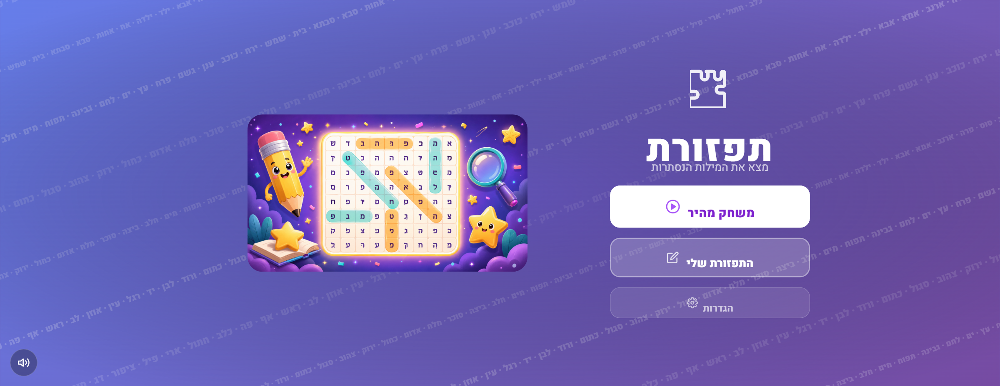
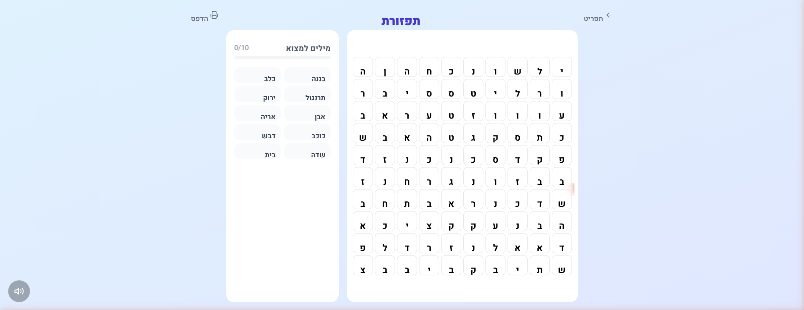

# תפזורת — Hebrew Word Search Game

> A cheerful Hebrew word search puzzle game for children aged 7+.
> No timers, no pressure — just fun!

## Screenshots

| Main Menu | Game Board |
|---|---|
|  |  |

---

## Features

- Hebrew word search on **8×8**, **10×10**, or **12×12** grids
- **7 word categories** — חיות, משפחה, טבע, חפצים, אוכל, צבעים, גוף
- **Custom presets** — create and save named puzzles with your own words
- **8 directions** — horizontal, vertical, and all diagonals
- **Hint system** — reveal a word if you're stuck
- Background music + sound effects (Web Audio API, no external files)
- **Print** any puzzle straight from the browser
- Fully **responsive** — desktop and mobile friendly
- Full **RTL** Hebrew layout

---

## Tech Stack

| | |
|---|---|
| UI | React 18 + TypeScript |
| Build | Vite |
| Styling | Tailwind CSS v3 |
| Routing | React Router v6 |

---

## Getting Started

**Prerequisites:** Node.js 18+ (only needed for the dev tooling — the game itself is pure client-side, no backend)

```bash
git clone https://github.com/barakgotesman/word-search.git
cd word-search
npm install
npm run dev
```

The terminal will print the local URL — open it in your browser.

## Scripts

| Command | Description |
|---|---|
| `npm run dev` | Start development server |
| `npm run build` | Production build → `dist/` |
| `npm run preview` | Preview production build |

---

## Project Structure

```
src/
├── components/
│   ├── screens/     # MainMenu, GameBoard, VictoryScreen, SettingsScreen, MyPuzzlesScreen
│   └── ui/          # PuzzleGrid, WordList, MusicButton, icons
├── context/         # GameContext — shared state across all routes
├── data/            # Hebrew word bank (~100 words across 7 categories)
├── types/           # TypeScript interfaces
└── utils/           # Puzzle generator, game helpers, sounds, music
```

---

## Adding Words

Open `src/data/wordBank.ts` and append to the relevant category array.
Keep words **2–5 Hebrew letters** for best fit on the default 10×10 grid.
Avoid final-form letters (ך ם ן ף ץ) — they can confuse young readers.
